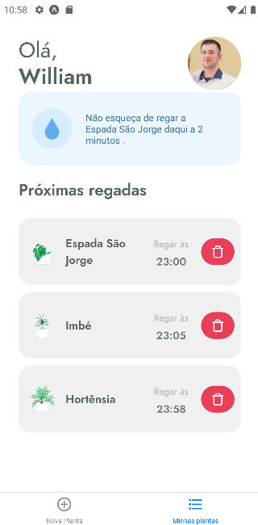
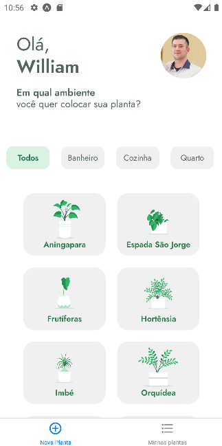
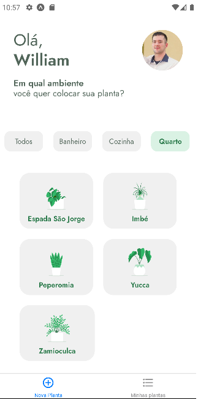
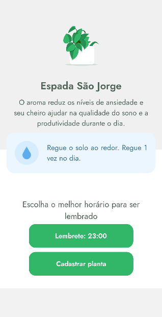

## Plant Manager App built with React Native during 'Next Level Week' event from RocketSeat 🚀

## Skills I learned with this project:
- Notification schedule
- Async Storage
- Local state management
- Routing
- TypeScript
- How to overcome deprecated UI packages
***
  
    